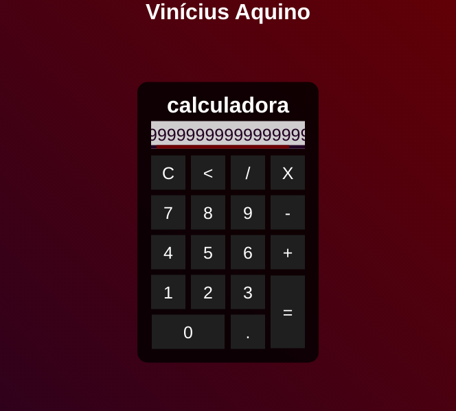

# Calculadora simples com HTML, CSS e JavaScript
> Projeto desenvolvido como metodologia de estudo e fixação de conteúdo com base no seguinte vídeo: https://youtu.be/42TShjXR0m0

## Como utilizar

Basta fazer o download do projeto e abrir o index.html em qualquer navegador de sua preferência.
